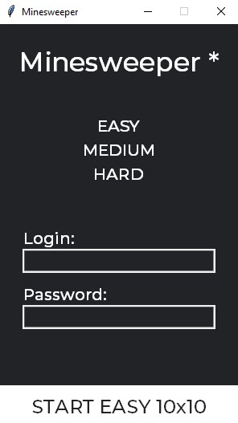
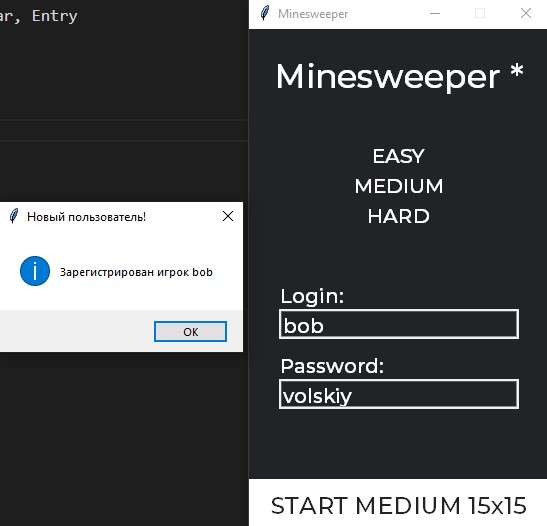
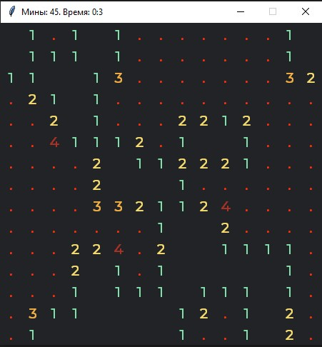
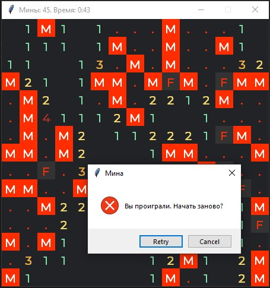

# Python Tkinter Calculator (without eval)
(University assignment)

Студент КПИ, если ты используешь мою работу для своей ДКР, то хотя бы закинь 1$ мне на патреон https://www.patreon.com/bob_volskiy

# UI look: 
  
  

# Features: 
  - Level selector
  - Authorization and save result for every player
  - Timer and bomb count
  - basic minesweeper functions: open, flag, near bomb counter, etc.

# Requirements: 
  - Montserrat Medium font (included in repo)

